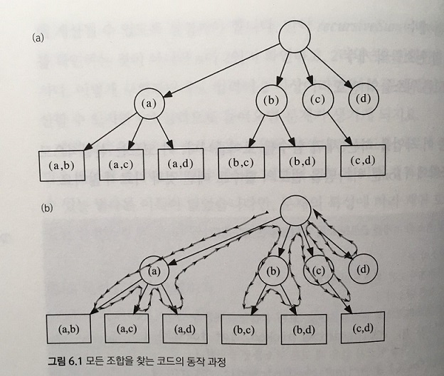

Brute-Force
===========



##  Brute-force

Solve the problem by brute-force(무식하게 풀기)  
[100,000,000 loops takes approximately 1 seconds]  
Also used on Optimization Problem[search all & find the optimization]


##  Exhausive Receipe

1. Deals with base case
2. Solve the problem using subproblem


##  Tips

- Force the order. eg. first on dictionary
- What to return? What to share?
- Remember, it is just a graph of state


## Examples

### Example 1

#### Problem
```cpp
/**
 * select combination of m elements from n elements
 * print it when any combination is done
 * @param n total number of elements
 * @param picked picked numbers
 * @param toPick # of elements to be picked
 */
void pick(int n, vector<int>& picked, int toPick);
```

#### Solution
```cpp
// -> it's just like a dfs which makes states by it's own
void pick(int n, vector<int>& picked, int toPick) {
  // base case
  if( toPick == 0 ) {
    for( int& num : picked ) cout << num << " ";
    cout << endl;
    return;
  }
  // smallest number of element which can be picked
  int start = picked.empty() ? 0 : picked.back() + 1;
  // select one element in this stage
  for( int next = start; next < n; ++next ) {
    picked.push_back(next);
    pick(n, picked, toPick - 1);
    picked.pop_back();
  }
}
```

### Example 2

#### Problem
```cpp
/**
 * Find if there exists a set of dwarfs whose sum == 100 && size == 7
 * @param candidates dwarfs
 * @param picked index of picked drarfs. Redundant
 * @param currentSum cumulative sum
 * @return existance of such set
 */
bool findRealDwarfs(vector<int>& candidates, vector<int>& picked, int currentSum);
```

#### Solution
```cpp
bool findRealDwarfs(vector<int>& candidates, vector<int>& picked, int currentSum) {
  bool found = false;

  // base case, target : 100
  if( picked.size() == 7 && currentSum == 100 ) return true;

  int start = picked.empty() ? 0 : picked.back() + 1;
  for( int i = start; i < candidates.size(); ++i ) {
    picked.push_back(i);
    ret = findRealDwarfs(candidates, picked, currentSum + candidates[i]);
    if( found == true ) break;  // once found it, break
    picked.pop_back();
  }

  return found;
}
```

###  Example 3

#### Problem
```cpp
/**
 * Find all possible permutations
 * @param nums numbers without duplication
 * @return all possible permutations
 */
vector<vector<int>> permute(vector<int>& nums);
```

#### Solution
```cpp
/* O(n^2) */
void findAllPossiblePermutations(const vector<int>& nums, vector<bool>& visited, vector<int>& picked, vector< vector<int> >& result) {
  if( picked.size() == nums.size() ) {
    result.push_back(picked);
    return;
  }

  for( int i = 0; i < nums.size(); ++i ) {
    if( !visited[i] ) {
      visited[i] = true;
      picked.push_back(nums[i]);
      findAllPossiblePermutations(nums, visited, picked, result);
      visited[i] = false;
      picked.pop_back();
    }
  }
}

vector<vector<int>> permute(vector<int>& nums) {
  vector< vector<int> > ret;

  vector<bool> visited(nums.size(), false);
  vector<int> picked;
  findAllPossiblePermutations(nums, visited, picked, ret);

  return ret;
}

// c++ std::next_permutation
// Different permutations can be ordered according to
// how they compare lexicographicaly to each other
vector<vector<int>> permute(vector<int>& nums) {
  vector< vector<int> > ret;

  sort(nums.begin(), nums.end()); // must be sorted
  do {
    ret.push_back(nums);
  } while( std::next_permutation(nums.begin(), nums.end()));

  return ret;
}
```

###  Example 4

#### Problem
Optimization problem  
Traveling Salesman problem  
Travel from current city to every cities and back to current city

#### Solution
```cpp

/* O((n-1)!) */

// stores distance between cities
// assume all the cities are connected each other
vector< vector<int> > distances;  

// path, currentLength store already solved information
// visited == true means already solved information
// visited == false stores information to be solved
int shortestPath(vector<int>& path, vector<bool>& visited, int currentLength) {
  // base case
  if( path.size() == distances.size() )
    return currentLength + distances[path[0]][path.back()];

  int ret = INF;  // INF : very big number

  // visit all the cities
  for( int next = 0; next < distances.size(); ++next ) {
    if( visited[next] ) {
      int here = path.back();

      path.push_back(next);
      visited[next] = true;

      int cand = shortestPath(path, visited, currentLength + distances[here][next]);

      // calc final solution with a subproblem
      ret = min(ret, cand);
      path.pop_back();
      visited[next] = false;
    }
  }

  return ret;
}
```
