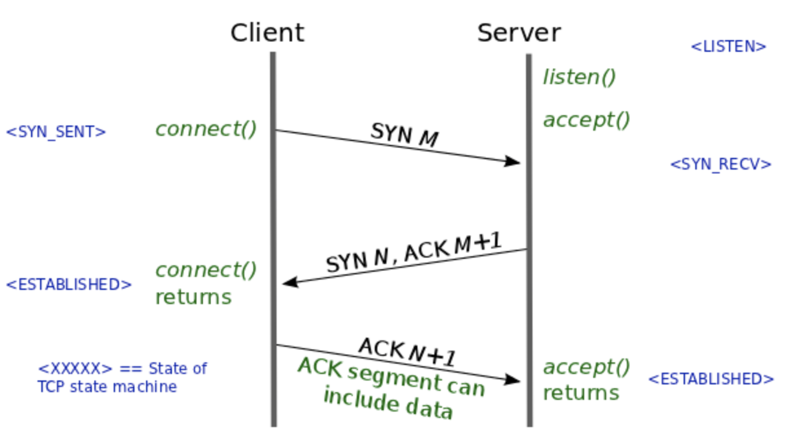
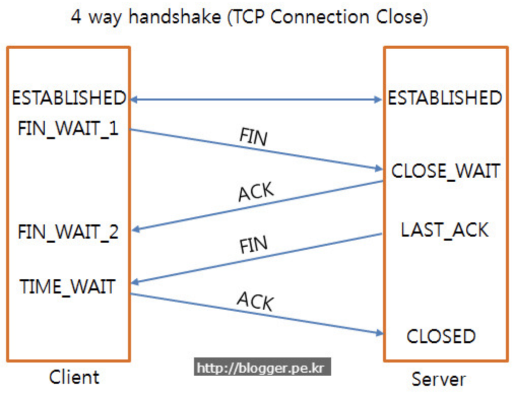

# Computer Network

- [Computer Network](#computer-network)
  - [What is Computer Network](#what-is-computer-network)
  - [OSI 7 Layer vs TCP/IP Layer](#osi-7-layer-vs-tcpip-layer)
  - [Application Layer](#application-layer)
    - [GET vs POST](#get-vs-post)
    - [HTTPS](#https)
    - [Domain](#domain)
    - [Load Balancing](#load-balancing)
    - [Keep Alive on HTTP](#keep-alive-on-http)
  - [Transport Layer](#transport-layer)
    - [TCP vs UDP](#tcp-vs-udp)
    - [TCP 3 way handshaking](#tcp-3-way-handshaking)
    - [TCP 4 way handshaking](#tcp-4-way-handshaking)
    - [Keep Alive on TCP](#keep-alive-on-tcp)
  - [Internet Layer](#internet-layer)
    - [Router](#router)
    - [Gateway](#gateway)
  - [Network Interface Layer](#network-interface-layer)
    - [Switch](#switch)
  - [Web Flow](#web-flow)
  - [References](#references)

## What is Computer Network

서로 다른 노드간 서로 자원을 공유할 수 있게 해주는 디지털 망

## OSI 7 Layer vs TCP/IP Layer

OSI 7 Layer (공식 표준)

- Application Layer : 사용자에게 가장 가까운 계층. HTTP, FTP, SMTP 등이 있음
- Presentational Layer : 데이터 표현이 상이한 응용 프로세스의 독립성을 제공하고 암호화함. JPEG, MPEG등이 있음
- Session Layer : 어플리케이션간 세션을 관리하고 구축.
- Transport Layer : 실제 데이터 전송. 오류 검출 및 복구와 흐름 제어를 제공. TCP, UDP등이 있음
- Network Layer : 라우팅을 통해 Packet단위로 데이터를 전송. IP등이 있음.
- DataLink Layer : 스위치 등의 장비를 통해 Frame단위로 데이터를 전송. MAC address를 가지고 통신
- Physical Layer : 랜선, 허브 등을 통해 Bit를 전송.

TCP/IP : de-facto standard (사실상 표준)

- Application Layer : Application + Presentational + Session Layer of OSI 7 layer
- Transport Layer : Transport Layer of OSI 7 layer
- Internet Layer : Network Layer of OSI 7 layer
- Network Interface Layer : DataLink + Physical Layer of OSI 7 layer

[위로](#computer-network)

## Application Layer

### GET vs POST

둘다 HTTP request방법중 하나임.

GET 방식은 요청하는 HTTP Request의 Header부분의 url에 데이터가 `?`식으로 담겨서 전송. 보통 정보를 조회할 때 사용함. 같은 요청에 대해서는 Browser단에서 cache를 해서 빠를 수 있음. But url에 담겨서 전송되기 때문에 크기가 제한적고 url에 정보가 다 드러나서 보안에 취약함.

POST 방식은 HTTP Request의 Body 부분에 데이터가 담겨서 전송. 주로 서버의 값이나 상태를 변경하는데 사용됨. 크기의 제한이 GET 보다는 더 크고 보안면에서 당장 보이진 않으니 상대적으로 나음. But cache가 안됨. 기술적으로 어떤 header를 넣으면 cache가 되긴 하는데 browser단에서 막아버림. 에초에 그런 용로도 있는 method가 아니라서.

### HTTPS

HTTP로 통신하는 소켓 부분을 TLS로 덮어쓴 거임. TLS(Transport Layer Security)란 데이터를 전송하기 전에 암호화하고 복호화 하는 기술.

1. 클라이언트가 서버에 접속하면 서버인증서(서버의 공개키를 인증기관이 전자서명으로 인증한 것)를 받음. 이때, 클라이언트 인증을 필요로 할 경우 클라이언트의 인증서를 전송.
2. 클라이언트는 받은 서버 인증서를 분석(보통 브라우져에 있음)하여 신뢰할 수 있는 인증서인지를 검토한 후, 서버의 공개키를 추출
3. 클라이언트가 대칭키로 사용할 임의의 메세지를 서버의 공개키로 암호화하여 서버에 전송
4. 서버에서는 자신의 **개인키**로 복호화하여 그 키를 사용하여 대칭키 암호방식으로 메시지를 암호화하여 클라이언트와 통신

Plain HTTP에 비해 데이터가 안전해 진다는 장점이 있으나 암호화/복호화 하는데 비용이 더 들음.

### Domain

숫자로만 이루어진 ip 는 사람들이 이해하거나 외우기가 어렵기에 편하게 쓰기위해 ip 별로 고유이름을 부여한 것. DNS서버에 domain name을 보내면 해당되는 ip를 알려줌.
  
### Load Balancing

가상 ip를 통하여 하나의 서비스를 여러대의 서버가 분산 처리하는 메커니즘. 서버의 트래픽을 분산시켜 처리속도를 올릴 수 있고 서버의 장애가 발생하더라도 서비스가 중단되지 않는다는 장점이 있음. 하지만 부하를 어떤 식으로 나눌 것인가 등의 문제를 해결해야 함.

- Round Robin : 각 서버에 돌아가면서 연결
- Least Connection : 가장 적은 collection을 가지고 있는 서버에 연결
- Weighted Least Connection : Least Connection의 서버에 가중치를 추가해서 가중치가 높은 서버에 먼저 분배
- Response Time : 응답시간이 빠른 서버에 conneciton을 우선 분배
- Hash : Hash 알고리즘을 적용하여 특정 서버에 connection을 연결한 클라이언트는 다음 연결에도 같은 서버에 연결. session관리에 편함.

### Keep Alive on HTTP

HTTP 는 비연결형 통신이기에 처리가 끝나면 연결을 해제함. 따라서 재요청시 커넥션을 다시 설정해야되는 비용이 큼. 이것을 해결하기 위해 Keepalive Timeout내에 재요청을하면 열려있는 커넥션을 통해 전송해서 커넥션을 재설정하는 비용을 줄임. But Keepalive timeout을 너무 길게 설정하면 keepalive하는 동안 다른 사용자가 연결을 못하게 될 수 있음.

[위로](#computer-network)

## Transport Layer

### TCP vs UDP

TCP (Transmission Control Protocol)은 데이터 전송의 신경을 쓰는 프로토콜로써 연결 지향형임. 흐름 제어 등을 통해 데이터 전송의 신뢰성을 보장할 수 있으나 그만큼 전송속도가 느리다는 단점이 있음.

UDP (User Datagram Protocol) 데이터를 일방적으로 보내는 것을 중요시 하는 프로토콜, 비연결형임. TCP보다 가볍고 빠르다는 장점이 있으나 데이터 전송의 신뢰성을 보장하지 않음.

### TCP 3 way handshaking

TCP에서 연결을 할 때 사용

초기 클라이언트 상태는 **CLOSED**, 서버의 상태는 **LISTEN**. 클라이언트가 서버에게 SYN(M) 신호를 보내고 **SYN_SENT**로 변경됨. SYN(M)을 받은 서버에서는 **SYN_RCV** 상태로 변경되고 ACK(M+1)와 함께 클라이언트의 포트도 열어달라는 요청으로 SYN(N)도 보냄. 둘다 받은 클라이언트는 **ESTABLISHED** 로 변경 응답신호로서 ACK(N + 1)를 서버에게 보낸다. ACK(N+1) 신호를 받은 서버는 **ESTABLISHED**상태가 됨.

### TCP 4 way handshaking

TCP에서 연결을 해제할 때 사용

A: 끊을게. B: 어 잠깐만 마저 하고, B: 어 다 했어 끊어. A : ok bye~

초기 서버와 클라이언트 상태는 **ESTABLISHED**. 클라이언트가 FIN을 서버에세 보내고 **FIN_WAIT_1** 상태로 변경.
FIN 을 받은 서버는 **ClOSE_WAIT** 상태로 변경되고 ACK 를 보냄. ACK 를 받은 클라언트는 다시 **FIN_WAIT_2** 상태로 변경. 서버가 남은 데이터를 다 전송하고 나면 FIN 을 클라이언트에 보내고 **LAST_ACK** 상태로 변경. FIN 을 받은 클라이언트는 **TIME_WAIT** 상태로 변경되면서 응답으로 ACK 를 서버에 보내고, 자신은 일정시간이 지난 후 **CLOSED** 상태로 변경. 마지막으로 ACK를 받은 서버는 **CLOSED** 상태로 변경.

### Keep Alive on TCP

일정 시간동안 서로의 패킷 교환이 없을 경우 payload 가 없는 패킷을 주기적으로 보냄. 하나가 다운되었을 때 다른 하나가 열려있는 것을 정리하기 위해 사용.

[위로](#computer-network)

## Internet Layer

### Router

IP주소를 이용해 목적지 포트로 패킷을 전송하는 장치

### Gateway

로컬망 라우터와 외부 망 라우터간의 통로

[위로](#computer-network)

## Network Interface Layer

### Switch

전송거리를 연장시켜주는 장치. MAC 주소를 통해 데이터를 전송.

[위로](#computer-network)

## Web Flow

우리가 Chrome 을 실행시켜 주소창에 특정 URL 값을 입력시키면 어떤 일이 일어나는가?

1. URL을 해석 (scheme:[//[user:password@]host[:port]][/]path[?query][#fragment])
2. Domain Name Server를 조회 함
3. ARP(Address Resolution Protocol)로 대상의 IP와 MAC주소를 알아냄
4. TCP통신을 통해 Socket을 열음. 이 과정에서 3-hand-shaking이 일어남
5. HTTP Protocol로 Request
6. HTTP Server가 Response
7. Browser가 rendering을 함

[위로](#computer-network)

## References

https://github.com/JaeYeopHan/Interview_Question_for_Beginner/tree/master/Network

https://hyeonu1258.github.io/2018/03/10/%EB%84%A4%ED%8A%B8%EC%9B%8C%ED%81%AC%ED%86%B5%EC%8B%A0%20%EB%A9%B4%EC%A0%91/

3 way handshaking

http://asfirstalways.tistory.com/356

Web flow

https://owlgwang.tistory.com/1