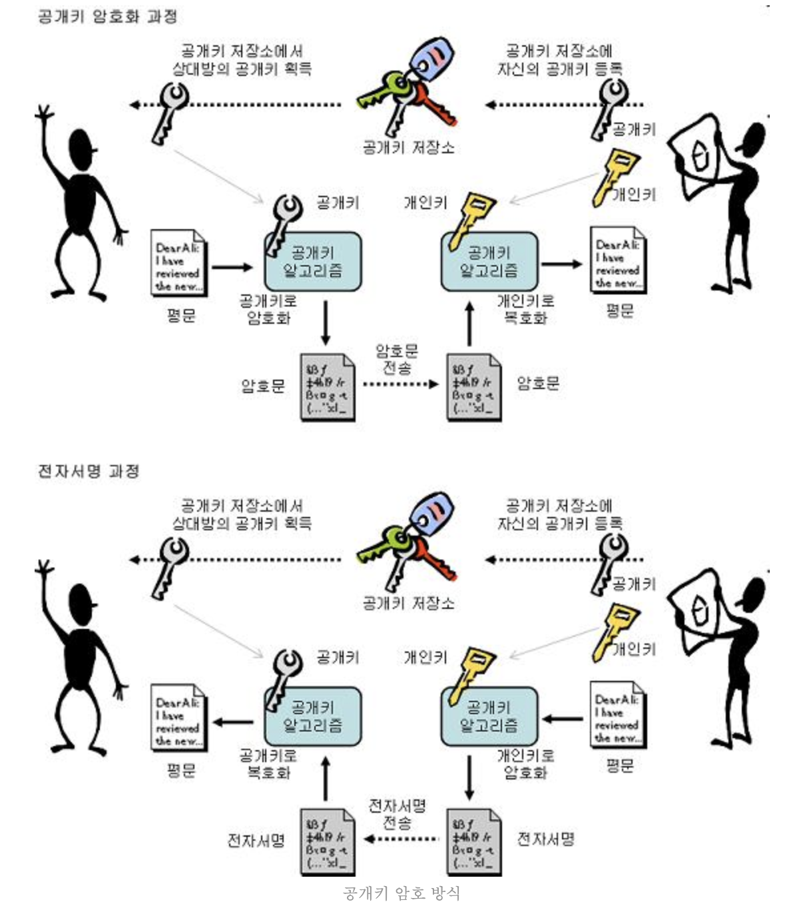

# Crypto

- [Crypto](#crypto)
  - [Symmetric Key Cryptography](#symmetric-key-cryptography)
  - [Public Key Cryptography](#public-key-cryptography)
    - [ECDSA](#ecdsa)
  - [References](#references)

## Symmetric Key Cryptography

동일한 키로 암호화/복호화를 하는 방식. 계산속도가 공개키보다 빠르나 비밀키 하나만 알아내면 해독 가능하다는 단점이 있음.

알고리즘으로는 AES, DES등이 있음.

## Public Key Cryptography

비대칭 키 암호화 방식. 한개의 키로 암호화를 하면 다른 키로 복호화를 함. 보내는 쪽이 공개키를 통해 암호화를 하면 받는 쪽은 개인키를 통해 복호화를 하는 식임. 개인키로 암호화를 할 때도 공개키로 풀 수 있음. But 공개키는 공개되어 있기 때문에 암호로써의 효용성이 없음. 하지만 특정 공개키로만 풀 수 있기 때문에 누가 암호화를 했는지는 알 수 있고 그래서 그래서 서명 (signature)으로 쓰이고 블록체인의 서명도 이런 원리임. 

알고지즘으로는 RSA, DSA, ECDSA 등이 있음

### ECDSA

Elliptic Curve (타원곡선, y^2 = x^3 + ax + b)에 기반한 공개키 암호화 방식으로 짧은 키로 RSA와 동일한 수준의 암호화를 가능하다는 장점이 있음. But 단점도 있는데 역으로 PrivateKey가 짧아서 품질이 떨어지는 난수 생성기를 사용하면 예측가능할 수 있다는 단점이 있음. 2013년도에 비트코인이 이런 식으로 한번 털린 적이 있는걸로 알음.

Bitcoin은 secp256k1(a = 0, b = 7)이라는 Curve의 스펙을 사용

## References

대칭키, 공개키

https://cryptocat.tistory.com/2