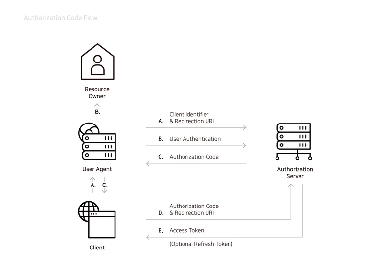

# Protocol Summary

- [Protocol Summary](#protocol-summary)
  - [HTTP](#http)
  - [HTTPS](#https)
  - [OAuth](#oauth)
    - [OAuth2.0](#oauth20)
  - [Streaming vs WebSocket](#streaming-vs-websocket)
  - [URI](#uri)
  - [JWT](#jwt)
  - [CSRF](#csrf)
  - [CORS](#cors)
  - [Cookie vs Session vs Cache](#cookie-vs-session-vs-cache)
  - [Rest API](#rest-api)
  - [Rest API over HTTP2](#rest-api-over-http2)
  - [References](#references)

---

## HTTP

- HTTP (HyperText Transfer Protocol)는 웹에서 request-response를 받을 수 있는 규약임
- HTTP/0.9 : 초기의 Protocol로 GET방식으로 단순히 데이터를 받아오는 것만 제공함. Header도 없음.
- HTTP/1.0 : 0.9에서 HEAD, POST등 여러 기능을 추가
- HTTP/1.1
  - 1.0의 단점을 보완하고 DELETE, PUT등 추가
  - Keep-Alive :  특정 timeout 이내에 요청이 오면 이전에 만든 Connection을 재사용하는 방법을 제공함
- HTTP/2.0
  - HTTP/1.1과 호환을 유지하면서 속도만 빠르게 할려고 나옴
  - 연결형. 양방향 통신이 가능
  - Header나 frame단에 높은 압축을 적용해서 속도가 빠름
  - frame단위로 전송하며 Multiplexing이 가능
- HTTP/3.0
  - UDP기반

## HTTPS

그냥 HTTP에서 통신 구간의 transport layer에 TLS를 적용한 것임.

## OAuth

- Open Authentication (또는 Authorization), User의 password를 Third party앱에 제공하지 않고 인증, 허가를 해주는 프로토콜
- Service Provider가 인증을 한 후 Access Token을 발급해줘서 Third party가 Service Provider의 API를 안전하게 이용하게해줌

### OAuth2.0

- 1.0a보다 간소화된 모델. Role들은
  - Resource Owner : 사용자 (User in 1.0a)
  - Resource Server : 리소스 서버 (Protected Resource in 1.0a)
  - Authorizaiton Server : 인증 서버로 Access Token을 받급해줌 (Service Provider in 1.0a)
  - Client : access token을 가지고 resource server에 요청을 하는 third-party application (Service Provider in 1.0a)
- Authorization Grant 방식
  1. Client가 Resource Owner의 User Agent에 Client ID와 redirection URI를 주면서 Authroization Endpoint로 접근하라고 지시
  2. User Agent가 Client ID, redirect URI를 주면서 Authorization Server에 login 페이지 요청
  3. Authorization Server가 User Agent에 Login Page제공
  4. User가 Authentication 정보 전달.
  5. Authorization Server가 Authorization Code발급.
  6. User Agent가 Client에 Authorization Code 전달
  7. Client가 Authorization Code를 활용하여 Authorization Server에 Access token 요청
  8. Authorization Server가 Access Token을 Client에 발급
  9. Client는 User Agent로부터 서비스 요청을 받으면 Access Token을 사용해서 Resource Server에서 API를 호출.

## Streaming vs WebSocket

- Streaming
  - HTTP 요청을 한번 한 후 body에서 계속 받는 식
- WebSocket
  - TCP기반 양방향으로 보낼 수 있는 프로토콜
  - WebSocket으로 Upgrade시 HTTP 사용

## URI

- Uniform Resource Identifier의 약자로 Resource를 식별하기 위한 표준임. schema://authority/path 이런 식으로 구분됨
- URL (Uniform Resource Locator)와 URN (Uniform Resource Name)을 포함함.

## JWT

- JSON Web Token의 약자로 인증 정보를 담고 있는 토큰. JSON형태의 인증 정보에 Signature포함하여 encoding한 후 전달하는 식
- 장점 : 사용자 인증시 별도의 저장소가 필요 없음
- 단점 : 유효기간이 만료되기 전에 탈취당하면 서버에서 이를 알 수 없음

## CSRF

- Cross Site Request Forger의 약자로 유효한 쿠키를 가지고 사용자가 원하지 않는 요청을 하는 것
- 방지법
  - input form에 csrf라는 hidden value를 삽입해서 요청 시 csrf도 같이 보내는 방식
  - SameSite Header를 사용해서 쿠키를 생성한 서버와 다른 사이트에서는 쿠키를 사용하지 않음

## CORS

- Cross-Origin Resource Sharing의 약쟈로 브라우져에 요청한 출처가 아닌 다른 출처로부터 자원을 받아올 수 있게 권한을 부여하도록 알려주는 것. 즉, 'www.naver.com'에 들어갔는데 'www.daum.net'에서 자원을 불러올 수 있게 알려주는 것
- 보안상 대부분 막혀있으나 image resource같은것을 불러올 때 풀어주기도 함
- 허락되는 URL는 'Access-Control-Allow-Origin' HTTP Header로 표현

## Cookie vs Session vs Cache

- Cookie
  - 클라이언트에 대한 정보를 클라이언트의 PC에 저장하기 위해 서버에서 클라이언트로 보내는 정보
- Session
  - 일정 시간 동안 사용자로부터 들어오는 요구를 하나의 상태로 보고 그것에 ID를 부여하여 일정하게 유지시키는 기술로 서버에 세션값을 저장
  - Client단에서는 보통 Cookie에 Session값을 저장
- Cache
  - 같은 요청에 대해 네트워크를 타지 않으려고 하는 것
  - Browser단에서 GET요청, Proxy server 등에서 사용할 수 있음

## Rest API

- Representational State Transfer의 약자로 요청을 복수명사로 표현한 resources와 그것에 대한 HTTP Method로 디자인 하는 방식 (CRUD -> POST, GET, PUT, DELETE)
- 특징
  - Stateless : 상태가 없어야 함
  - Cacheable : cache할 수 있어야 함
  - 계층형 구조 : 다중 계층으로 구성될 수 있어서 보안, 암호화 같은 것을 쉽게 추가할 수 있어야함
- 정확한 표준은 없고 그냥 이런 식으로 하자는게 있음. 생각해 보면 defacto 표준급인거 같음

## Rest API over HTTP2

- HTTP/2.0이 HTTP/1.1와 하위호환을 유지하면서 속도만 빠르게 하려고 한거라 그대로 사용 가능
- 형태는 유지하면서 Multiflexing, 양방향 통신, header & frame압축 등을 이용할 수 있음
- 단점 : HTTP/2.0은 binary단위로 전송하기 때문에 클라이언트에서 이를 해석해야 함

## References

HTTP

https://medium.com/platform-engineer/evolution-of-http-69cfe6531ba0

https://medium.com/platform-engineer/web-api-design-35df8167460

OAuth

http://homoefficio.github.io/2018/08/27/%EC%8A%A4%ED%8E%99%EB%94%B0%EB%9D%BC-%EB%A7%8C%EB%93%A4%EC%96%B4%EB%B3%B4%EB%8A%94-OAuth-1-0a-Client/

JWT Token

https://velopert.com/2389

https://brownbears.tistory.com/440

CORS

https://developer.mozilla.org/ko/docs/Web/HTTP/CORS

Cookie, Session, Cache

Http Security Headers

https://owasp.org/www-project-secure-headers/#tab=Headers

Rest API over HTTP2

https://dzone.com/articles/benefits-of-rest-apis-with-http2
