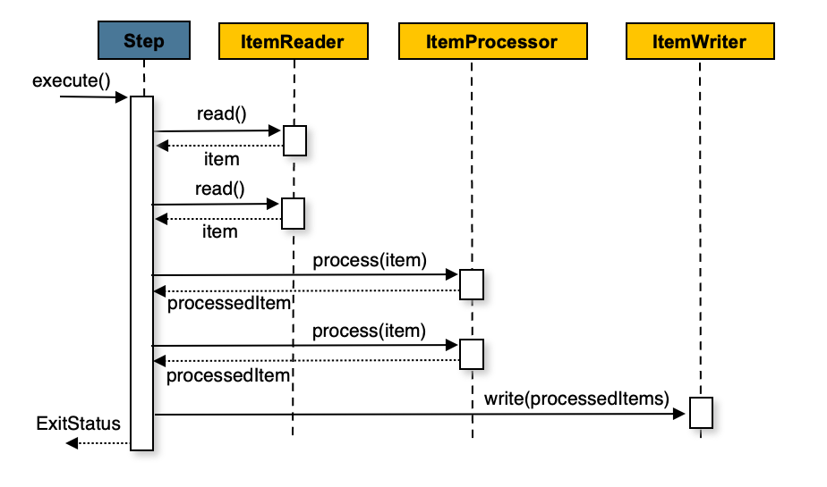
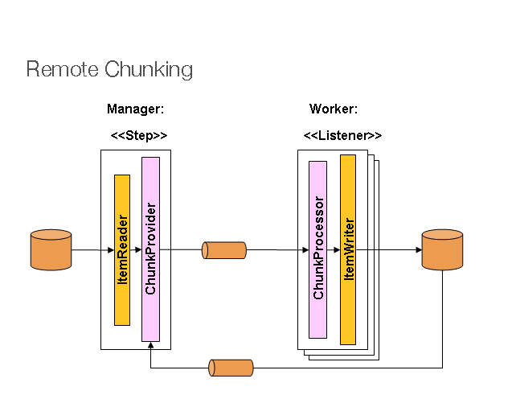
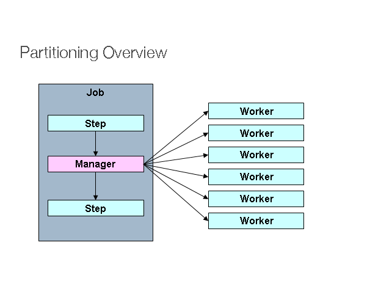

# Spring Batch

## Introduction

It provides

- Reusable functions that are essential in processing large volumes of records, including logging/tracing, transaction management, job processing
  statistics, job restart, skip, and resource management
- Advanced technical services and features that enable extremely high-volume and high performance batch jobs through optimization and partitioning
  techniques

It's not a scheduler. It is intended to work in conjunction with a scheduler.

## Architecture


Layered Architecture

- Application
    - Contains all batch jobs and custom code written by developers using Spring Batch
- Batch Core
    - Contains the core runtime classes necessary to launch and control a batch job. It includes implementations for JobLauncher, Job, and Step.
- Batch Infrastructure
    - Contains common readers and writers and services (such as the RetryTemplate), which are used both by application developers (such as ItemReader
      and ItemWriter) and the core framework itself.

## Core Concept


A Job has one to many steps, each of which has exactly one ItemReader, one ItemProcessor, and one ItemWriter.\
A job needs to be launched (with JobLauncher), and metadata needs to be stored in JobRepository.

### Job


- Job : Job configuration including name, step ordering, restartable, etc..
- JobInstance : The concept of a logical job run.
    - Distinguished by identifying JobParameters.
    - JobParameters : Holds a set of parameters used to start a batch job.
        - Has identifying flag to determine whether to be used as JobInstance identification.
- JobExecution : The technical concept of a single attempt to run a Job.
    - The JobInstance corresponding to a given execution is not considered to be complete unless the execution completes successfully.
        - eg. JobInstance for 01-01-2017 that failed. If it run with the same job parameters, a new JobExecution is created. But still only one
          JobInstance.

### Step


- Step : A domain object that encapsulates an independent, sequential phase of a batch job.
- StepExecution : A single attempt to execute a Step.
    - If a step fails to execute because the step before it fails, no execution is persisted for it. A StepExecution is created only when its Step is
      actually started.

### ExecutionContext

- Represents a collection of key/value pairs that are persisted and controlled by the framework.
- Allow developers a place to store persistent state that is scoped to a StepExecution object or a JobExecution object.
- JobExecution::ExecutionContext
    - At least one ExecutionContext per JobExecution.
    - Saved in between every StepExecution.
- StepExecution::ExecutionContext
    - ExecutionContext for every StepExecution
    - Saved at every commit point in the Step.

```java
// ecJob does not equal ecStep
ExecutionContext ecJob=jobExecution.getExecutionContext();
		ExecutionContext ecStep=stepExecution.getExecutionContext();
```

### JobRepository

- Provides CRUD operations for JobLauncher, Job, and Step implementations.

### JobLauncher

- Represents a simple interface for launching a Job with a given set of JobParameters.

### Item Reader/Writer/Processor

- ItemReader : Represents the retrieval of input for a Step, one item at a time.
- ItemWriter : Represents the output of a Step, one batch or chunk of items at a time.
- ItemProcessor : Represents the business processing of an item.

### Chunk-oriented Processing



- Reading the data one at a time and creating 'chunks' that are written out within a transaction boundary.

```java
// pseudo code of chunk-oriented processing

List items = new Arraylist();
for(int i = 0; i < commitInterval; i++){
    Object item = itemReader.read();
    if (item != null) {
        items.add(item);
    }
}

List processedItems = new Arraylist();
for(Object item: items){
    Object processedItem = itemProcessor.process(item);
    if (processedItem != null) {
        processedItems.add(processedItem);
    }
}

itemWriter.write(processedItems);
```

## Scalling

### Remote Chunking



- Step processing is split across multiple processes, communicating with each other through some middleware.
- Works best if the manager is not a bottleneck, so the processing must be more expensive than the reading of item.

### Partitioning



## References

- [spring batch official docs](https://docs.spring.io/spring-batch/docs/current/reference/html/index.html)
