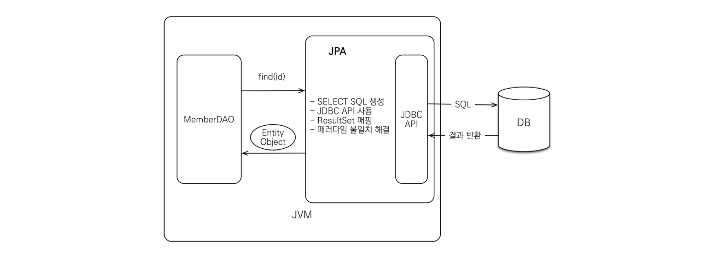

# JPA

- [JPA](#jpa)
  - [Problem of SQL Oriented Development](#problem-of-sql-oriented-development)
  - [ORM & JPA](#orm--jpa)
  - [How JPA works](#how-jpa-works)
  - [EntityManagerFactory, EntityManager](#entitymanagerfactory-entitymanager)
  - [Persistant Context](#persistant-context)
    - [Read](#read)
    - [Create](#create)
    - [Update](#update)
    - [Delete](#delete)
    - [Flush](#flush)
    - [Detached](#detached)
  - [References](#references)

## Problem of SQL Oriented Development

- 지루한 코드의 무한 반복
  - 자바객체 <-> SQL 변환 과정의 반복. eg. field하나 추가하면 class에 추가하고 CRUD에 다 추가해야함
- OOP와 RDB간 패러다임 불일치
  - OOP
    - 상속이 있음
    - 양방향 연관관계가 없음. 만들려면 단방향 연관관계를 2개 만들어야 함
  - RDB
    
    - 상속이 없음. 비슷한 걸로 Table supertype-subtype이 있으나 저장할 때 각 테이블에 insert를 날려야 하고 조회할 때 join을 해야 함
    - 기본적으로 앙뱡향 join이 가능
  
  - 객체 그래프 탐색을 할 때 OOP는 reference가 있어서 자유롭게 탐색할 수 있으나 SQL을 객체에 Mapping하는 과정에서 객체 그래프의 대상이 query가 되었는지 알 수 없음. 이를 Entity 신뢰의 문제라고 함

## ORM & JPA

- ORM (Object-Relational Mapping) 객체는 객체대로 설계하고 RDB는 RDB대로 설계하면 중간에서 이를 매핑해주는 녀석
- JPA (Java Persistence API)는 Java진영의 ORM표준 스펙. 구현체로 Hibernate, EclipseLink, DataNucleus가 있음

## How JPA works




- Application과 JDBC사이에서 동작. 사용자가 JPA를 통해 요청을 하면 알아서 JDBC를 이용해서 쿼리를 실행해 줌
  - Insert
    1. 개발자는 JPA에 Member 객체를 넘김
    2. JPA가 엔티티를 분석해서 적절한 INSERT SQL을 생성
    3. JPA가 JDBC API를 사용하여 SQL을 DB에 날린다
  - Query
    1. 개발자는 member의 pk 값을 JPA에 넘김
    2. JPA가 엔티티를 분석해서 적절한 SELECT SQL을 생성
    3. JPA가 JDBC API를 사용하여 SQL을 DB에 날림
    4. JPA가 DB로부터 결과를 받아옴
    5. JPA가 결과(ResultSet)를 객체에 모두 매핑해서 return

## EntityManagerFactory, EntityManager

- EntityManagerFactory : EntityManager를 생성하는 녀석으로 내부적으로 DB connection pool을 사용함. Application loading시점에 딱 하나만 생성되어야 함
- EntityManager : Entity의 CRUD를 하는 객체. 변경을 하기 전에 Transaction을 실행

```java
// application loading 시점에 DB 당 딱 하나만 생성되어야 한다.
EntityManagerFactory entityManagerFactory = Persistence.createEntityManagerFactory("hello");

EntityManager entityManager = entityManagerFactory.createEntityManager();

EntityTransaction tx = entityManager.getTransaction();
tx.begin();  // Transaction 시작
tx.commit();  // Transaction 수행
tx.rollback();  // 작업에 문제가 생겼을 시

entityManager.close(); // DB connection을 반환

// application이 종료되는 시점에 close
entityManagerFactory.close();
```

## Persistant Context


- Entity를 영구히 저장하는 환경으로 User Application과 DB의 사이에 위치. EntityManager마다 생성됨
- query를 쌓아뒀다가 한번에 요청할 수 있는 buffering, 똑같은 요청에 대해 db를 안거치고 바로 return해주는 caching의 기능을 할 수 있음
- Entity의 LifeCycle
  - new / transient (비영속) : 객체를 새로 생성한 것으로 Persistent Context와 관계가 없는 상태
  - managed (영속) : Persistant Context에 저장된 상태
  - detatched (준영속) : Persistant Context에서 지운 상태
  - removed (삭제) : 실제 DB에 삭제를 요청한 상태

```java
EntityManager entityManager = entityManagerFactory.createEntityManager();
entityManager.getTransaction().begin();

// 객체를 생성한 상태 (비영속)
Member member = new Member();
member.setId("member1");
member.setUsername("회원1");

// 객체를 저장한 상태 (영속)
entityManager.persist(member);

// 회원 엔티티를 영속성 컨텍스트에서 분리, 준영속 상태
entityManager.detach(member);

// 객체를 삭제한 상태
entityManager.remove(member);
```

### Read

Read : 조회 시 1차 cache를 통해 같은 key로 가져오면 같은 객체를 return함

```java
Member a = entityManager.find(Member.class, "member1");
Member b = entityManager.find(Member.class, "member1");
System.out.println(a == b); // 동일성 비교 true
```

### Create

Create : Transaction Write-Behind를 통해 commit 전까지는 실제 db에 요청을 하지 않음

```java
EntityManager entityManager = emf.createEntityManager();
EntityTransaction transaction = entityManager.getTransaction();
transaction.begin(); // Transaction 시작

entityManager.persist(memberA);
entityManager.persist(memberB);

// 커밋하는 순간 DB에 INSERT SQL을 보낸다.
transaction.commit(); // Transaction 커밋
```

### Update

Update : Dirty Checking을 통해 처음 읽어온 snapshot과 비교를 해서 다르면 전체 field를 업데이트 하는 query를 날림.

```java
EntityManager em = emf.createEntityManager();
EntityTransaction transaction = em.getTransaction();
transaction.begin(); // Transaction 시작

Member memberA = em.find(Member.class, "memberA"); // 조회

memberA.setUsername("hi"); // 수정
memberA.setAge(10);

// em.update(member) 또는 em.persist(member) 이런 코드 없어도 됨

transaction.commit(); // Transaction 커밋
```

### Delete

Delete : `em.remove`를 통해 삭제 요청을 할 수 있으나 역시 commit전까지는 반영이 안됨.

```java
transaction.begin(); // Transaction 시작

Member memberA = em.find(Member.class, "memberA");
em.remove(memberA); // 엔티티 삭제

transaction.commit(); // Transaction 커밋
```

### Flush

- PersistContext의 변경 내용을 DB에 반영하는 것
- Flush하는 방법
  - 직접 호출
  - transaction commit (commit하기 전에 flush가 발생)
  - JPQL 쿼리 실행 (JPQL을 SQL로 번역이 되서 날라가는 것이기 때문에 강제로 sync를 맞춰줌)

```java
Member member = new Member(200L, "A");
entityManager.persist(member);

entityManager.flush(); // 강제 호출 (쿼리가 DB 에 반영됨)

tx.commit(); // flush 암시적으로 실행
```

```java
em.persist(memberA);
em.persist(memberB);
em.persist(memberC);

// JPQL 실행 : flush 호출
query = entityManager.createQuery("select m from Member m", Member.class);
// member a, b, c조회
List<Member> members = query.getResultList();
```

### Detached

detach나 clear를 하면 detach로 변경됨

```java
// 영속 상태 (Persistence Context 에 의해 Entity 가 관리되는 상태)
Member findMember = entityManager.find(Member.class, 150L);
findMember.setName("AAAAA"); // update

entityManager.detach(findMember); // 영속성 컨텍스트에서 떼넨다. (더 이상 JPA 의 관리 대상이 아님.)

tx.commit(); // DB에 insert query 가 날라가는 시점 (아무 일도 발생하지 않음.)
```

```java
// 영속 상태 (Persistence Context 에 의해 Entity 가 관리되는 상태)
Member findMember = entityManager.find(Member.class, 150L);
findMember.setName("AAAAA"); // update

entityManager.clear(); // 영속성 컨텍스트를 완전히 초기화

Member findMember2 = entityManager.find(Member.class, 150L); // 간은 Entity 를 다시 조회

tx.commit(); // DB에 insert query 가 날라가는 시점 (아무일도 발생하지 않음.)
```

## References

https://gmlwjd9405.github.io/2019/08/03/reason-why-use-jpa.html

https://gmlwjd9405.github.io/2019/08/04/what-is-jpa.html

https://gmlwjd9405.github.io/2019/08/06/persistence-context.html

https://gmlwjd9405.github.io/2019/08/07/what-is-flush.html

https://gmlwjd9405.github.io/2019/08/08/jpa-entity-lifecycle.html
