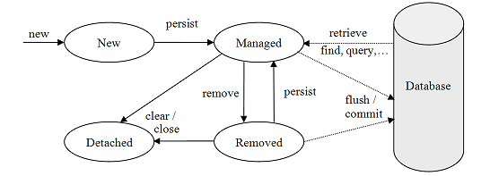

# JPA

- [JPA](#jpa)
  - [Problem of SQL Oriented Development](#problem-of-sql-oriented-development)
  - [Concept](#concept)
    - [How JPA works](#how-jpa-works)
  - [Persistant Context](#persistant-context)
  - [Entity LifeCycle](#entity-lifecycle)
  - [References](#references)

## Problem of SQL Oriented Development

1. 지루한 코드의 무한 반복
    - 자바 객체를 SQL로, SQL을 자바 객체로 변환하는 과정의 반복
    - Ex) Field하나 추가 시 1. class에 추가, 2. INSERT, SELECT, UPDATE 등 관련된 모든 쿼리에 추가
2. OOP와 RDB간 패러다임 불일치
    - 상속
      - OOP : 있음
        - 객체의 저장 : `list.add(xxx)`
        - 객체의 조회 : `list.get(xxx)`
      - RDB : 없음. 비슷한 걸로 Table supertype-subtype이 있으나..
        
        - 객체의 저장 : 객체를 분해한 후 각각 다른 테이블에 대해 INSERT를 두번 날림
        - 객체의 조회 : 두개의 테이블에 대해 Join을 하고 값에 대한 모든 필드값을 설정
    - Association
      
      - OOP : Reference를 사용. 단방향으로만 조회가 가능 (`member.getTeam()`)
      - RDB : PK와 FK + Join을 사용해서 관계. 양방향으로 조회가 가능 (`JOIN ON M.TEAM_ID = T.TEAM_ID`)
    - 객체 그래프 탐색
      
      - 객체는 자유롭게 객체간 연간관계를 탐색할 수 있음. But 앞서 말한 association의 문제 때문에
        query를 할 때 해당 객체에 대해서도 조회되었는지 알 수가 없음. 즉 `member.getTeam().getOrderItem()`
        이 항상 성공한다고 보장할 수 없음. 이를 Entity 신뢰의 문제라고 함.

이것들을 해결하려고 나온 것이 JPA

## Concept

- ORM(Object-Relational Mapping) 객체는 객체대로 설계하고 RDB는 RDB대로 설계하면 중간에서 이를 매핑해주는 녀석임
- JPA(Java Persistence API)는 Java진영의 ORM표준으로 EJB스타일의 ORM의 문제를 많이 해결한 것
- JPA는 스펙일 뿐임! 구현체로 Hibernate, EclipseLink, DataNucleus가 있음

### How JPA works

Application과 JDBC사이에서 동작. 사용자가 JPA를 통해 요청을 하면 내부적으로 JDBC를 사용해서 SQL을 호출하는 식임.
쿼리를 JPA가 만들어주기 때문에 사용자는 신경 안써도 됨

삽입할 경우

1. 개발자는 JPA에 Member 객체를 넘긴다.
2. JPA가 엔티티를 분석해서 적절한 INSERT SQL을 생성
3. JPA가 JDBC API를 사용하여 SQL을 DB에 날린다

조회할 경우

1. 개발자는 member의 pk 값을 JPA에 넘긴다.
2. JPA가 엔티티를 분석해서 적절한 SELECT SQL을 생성
3. JPA가 JDBC API를 사용하여 SQL을 DB에 날린다.
4. JPA가 DB로부터 결과를 받아온다.
5. JPA가 결과(ResultSet)를 객체에 모두 매핑

## Persistant Context

## Entity LifeCycle

## References

https://gmlwjd9405.github.io/2019/08/03/reason-why-use-jpa.html

https://gmlwjd9405.github.io/2019/08/04/what-is-jpa.html

https://gmlwjd9405.github.io/2019/08/06/persistence-context.html

https://gmlwjd9405.github.io/2019/08/07/what-is-flush.html

https://gmlwjd9405.github.io/2019/08/08/jpa-entity-lifecycle.html