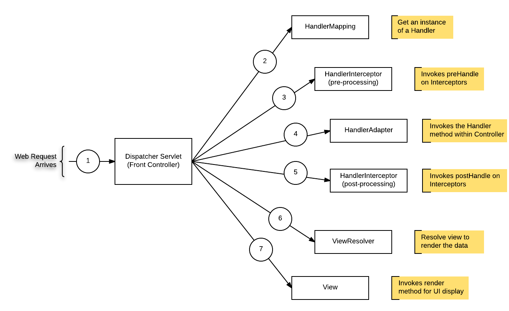

# Spring Web MVC

- [Spring Web MVC](#spring-web-mvc)
  - [Servlet](#servlet)
    - [Servlet 동작 과정](#servlet-%eb%8f%99%ec%9e%91-%ea%b3%bc%ec%a0%95)
    - [Servlet Listener](#servlet-listener)
    - [Servlet Filter](#servlet-filter)
  - [DispatcherServlet](#dispatcherservlet)
    - [Dispatcher Servlet 동작 과정](#dispatcher-servlet-%eb%8f%99%ec%9e%91-%ea%b3%bc%ec%a0%95)
    - [Dispatcher Servlet over Servlet Container](#dispatcher-servlet-over-servlet-container)
    - [Embedded Tomcat](#embedded-tomcat)
  - [References](#references)

## Servlet

자바를 사용하여 동적으로 웹페이지를 생성해 주는 서버측 프로그램 혹은 스펙. Tomcat이나 Jetty 같은 Servlet Container위에서 돌아간다.

### Servlet 동작 과정

1. Servlet Container가 Servlet을 init한다 (요청시)
2. 요청을 받을 시 doService가 처리한다. 보통 doGet이나 doPost같은 것으로 처리한다.
3. Servlet Container가 종료될 때 destroy를 호출한다.

### Servlet Listener

Web Application에서 발행하는 이벤트를 감지하고 이벤트에 해당하는 작업을 하는 녀석.

### Servlet Filter

요청을 Servlet으로 보낼 때 또는 Servlet이 작성한 response를 클라이언트로 보내기 전에 전처리를 하는 녀석으로 보통 filter chain형태로 구현

## DispatcherServlet

Spring에서 제공하는 Servlet스펙에 대한 구현체로 하나의 컨트롤러 (Front Controller)로 요청을 받은 후 dispatch해서 처리를 하는 서블릿

### Dispatcher Servlet 동작 과정

1. Request
2. HandlerMapping : Handler (controller)를 찾음
3. HandlerIntercepter : pre-processing
4. HandlerAdaptor : Handler (controller)를 실행
5. HandlerIntercepter : post-processing
6. ViewResolver : view를 찾음
7. Render view

### Dispatcher Servlet over Servlet Container

`DispatcherServlet`을 Servlet에 등록하고 `ContextLoaderListener`를 Listener에 등록하면 `ContextLoaderListener`가 ApplicatonContext를 초기화하고 DispatcherServlet이 Front Controller역할을 해서 동작하는 형태.

### Embedded Tomcat

Spring Application 위에 Embedded Tomcat이 있고 그 위에 Dispatcher Servlet이 올라가는 형태. Ioc Container는 Embedded Tomcat밖에 있음.

## References

https://docs.spring.io/spring/docs/current/spring-framework-reference/web.html
